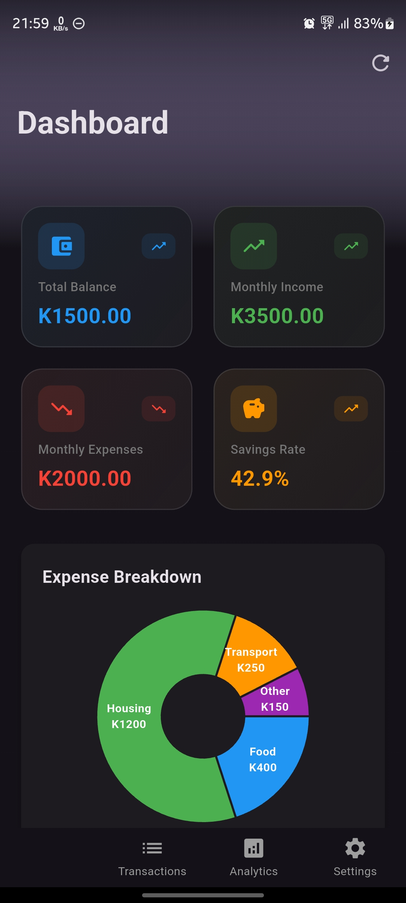

# Balance Sheet - Personal Finance Tracker


[](https://pub.dev/packages/very_good_analysis)
[](https://opensource.org/licenses/MIT)

A modern Flutter application for tracking personal finances with an intuitive interface, real-time calculations, and interactive visualizations.

---

## 🚀 Try the App (APK Download)

Want to see the app in action without building from source? Download the production demo APK directly!

👉 **[Download v0.0.1 Demo APK]([https://github.com/Emelio101/balance-sheet/releases/download/v0.0.1/balance_sheet_v0.0.1_demo.apk](https://github.com/Emelio101/balance-sheet/releases/download/v0.0.1(2)/app-production-debug.apk))**

> **Note:** This is a **production-flavor debug build** (v0.0.1) for demo purposes. As it's not from the Play Store, Android will require you to allow installation from "Unknown Sources".

### Installation Steps:
1. Download the APK above
2. On your Android device, tap the downloaded file
3. If prompted, allow "Install from unknown sources"
4. Launch the app and explore!

### Build Info
```bash
# This APK was built using:
flutter build apk --flavor production --target lib/main_production.dart --debug
```

---

## ✨ Features

### 📊 Dashboard
- **Real-time Financial Overview** - Cards displaying current balance, income, expenses, and savings rate
- **Interactive Charts**
    - Pie chart showing expense breakdown by category
    - Line chart displaying income vs expenses trends over 6 months
- **Live Data Sync** - Dashboard automatically updates when transactions are added or removed
- **Pull to Refresh** - Manually refresh dashboard data

### 💰 Transactions Management
- **Add Transactions** - Comprehensive form with validation
    - Toggle between Income/Expense types
    - Dynamic category selection based on transaction type
    - Amount validation with decimal support
    - Date picker for historical transactions
    - Optional description field
- **View All Transactions** - Organized list with visual indicators
- **Swipe to Delete** - Quick removal with deletion confirmation
- **Empty State** - Helpful prompts when no transactions exist
- **Real-time Calculations** - All financial metrics update instantly

### ⚙️ Settings
- **Theme Toggle** - Switch between light and dark mode
- **Currency Selection** - Support for multiple currencies
  - ZMW (K), ZAR (R), NGN (₦), KES (KSh)
  - USD ($), EUR (€), GBP (£), JPY (¥)
- **Organized Interface** - Settings grouped by category

### 📈 Analytics (Coming Soon)
- Detailed financial reports
- Spending insights and patterns
- Budget tracking and predictions

## 🚀 Tech Stack

- **Framework**: Flutter 3.0+
- **State Management**: flutter_bloc (BLoC/Cubit pattern)
- **Charts**: fl_chart
- **Architecture**: Clean Architecture with Feature-First structure
- **Code Generation**: Very Good CLI

---

## 📦 Dependencies

```yaml
dependencies:
  flutter:
    sdk: flutter
  
  # State Management
  flutter_bloc: ^8.1.3
  bloc: ^8.1.2
  equatable: ^2.0.5
  
  # Charts and Visualization
  fl_chart: ^0.66.0
  
  # UI
  cupertino_icons: ^1.0.2
  google_fonts: ^6.1.0

dev_dependencies:
  flutter_test:
    sdk: flutter
  flutter_lints: ^3.0.0
  very_good_analysis: ^5.1.0
```

---

## 🛠️ Installation

### Prerequisites
- Flutter SDK (3.0.0 or higher)
- Dart SDK (3.0.0 or higher)
- Android Studio / VS Code with Flutter extensions

## 📁 Project Structure

```
lib/
├── app/
│   ├── theme/
│   │   ├── theme_cubit.dart
│   │   └── theme_state.dart
│   └── app.dart
├── dashboard/
│   ├── cubit/
│   │   ├── dashboard_cubit.dart
│   │   └── dashboard_state.dart
│   ├── widgets/
│   │   └── dashboard_card.dart
│   ├── dashboard_body.dart
│   └── dashboard.dart
├── home/
│   ├── cubit/
│   │   ├── home_cubit.dart
│   │   └── home_state.dart
│   └── home_body.dart
├── models/
│   └── transaction_model.dart
├── settings/
│   ├── cubit/
│   │   ├── settings_cubit.dart
│   │   └── settings_state.dart
│   ├── settings_body.dart
│   └── settings.dart
├── transactions/
│   ├── cubit/
│   │   ├── transactions_cubit.dart
│   │   └── transactions_state.dart
│   ├── widgets/
│   │   ├── transaction_item.dart
│   │   └── add_transaction_dialog.dart
│   ├── transactions_body.dart
│   └── transactions.dart
├── widgets/
│   └── app_alerts.dart
└── main.dart
```

---

## 🎯 Usage

### Adding a Transaction

1. Navigate to the **Transactions** tab
2. Tap the floating action button **(+)**
3. Choose transaction type (Income/Expense)
4. Fill in the details:
    - **Title**: Name of the transaction
    - **Amount**: Numerical value (supports decimals)
    - **Category**: Select from predefined categories
    - **Date**: Pick a date (defaults to today)
    - **Description**: Optional notes
5. Tap **"Add Transaction"**

### Viewing Financial Overview

1. Open the **Dashboard** tab
2. View your financial metrics:
    - Total Balance
    - Monthly Income
    - Monthly Expenses
    - Savings Rate (%)
3. Scroll down to see:
    - Pie chart of expense categories
    - Line chart of income vs expenses trends

### Changing Settings

1. Go to the **Settings** tab
2. Toggle **Dark Mode** for theme switching
3. Tap **Currency** to select your preferred currency
4. Changes apply immediately across the app

### Deleting Transactions

1. In the **Transactions** tab
2. Swipe left on any transaction
3. Transaction is removed and dashboard updates automatically

---

## 🔧 Customization

### Adding New Transaction Categories

Edit the category lists in `add_transaction_dialog.dart`:

```dart
final List<String> _expenseCategories = [
  'Food',
  'Housing',
  'Transport',
  'Your New Category',
];

final List<String> _incomeCategories = [
  'Salary',
  'Business',
  'Your New Source',
];
```

### Adding New Currencies

Edit the currency list in `settings_body.dart`:

```dart
final currencies = [
  {'code': 'USD', 'name': 'US Dollar', 'symbol': '\$'},
  {'code': 'YOUR_CODE', 'name': 'Your Currency', 'symbol': 'X'},
];
```

### Customizing Dashboard Cards

Modify `dashboard_body.dart` to add or change dashboard cards:

```dart
DashboardCard(
  title: 'Your Metric',
  amount: yourValue,
  icon: Icons.your_icon,
  color: Colors.yourColor,
),
```

---

## 🧪 Testing

Run all tests:
```bash
flutter test
```

Run tests with coverage:
```bash
flutter test --coverage
```

Generate coverage report:
```bash
genhtml coverage/lcov.info -o coverage/html
open coverage/html/index.html
```

---

## 🚧 Roadmap

### Phase 1: Core Enhancements
- [ ] Data persistence (Hive/SQLite)
- [ ] Transaction editing
- [ ] Search and filter transactions
- [ ] Export to CSV/PDF

### Phase 2: Advanced Features
- [ ] Budget creation and tracking
- [ ] Recurring transactions
- [ ] Bill reminders and notifications
- [ ] Multiple account support
- [ ] Investment tracking

### Phase 3: Cloud & Sync
- [ ] Cloud backup
- [ ] Multi-device synchronization
- [ ] Collaboration features
- [ ] Data encryption

### Phase 4: Analytics & AI
- [ ] Advanced spending insights
- [ ] Predictive analytics
- [ ] AI-powered financial advice
- [ ] Custom reports

---

## 🤝 Contributing

Contributions are welcome! Please follow these steps:

1. **Fork the repository**
2. **Create a feature branch**
   ```bash
   git checkout -b feature/amazing-feature
   ```
3. **Commit your changes**
   ```bash
   git commit -m 'Add some amazing feature'
   ```
4. **Push to the branch**
   ```bash
   git push origin feature/amazing-feature
   ```
5. **Open a Pull Request**

### Coding Standards
- Follow the [Very Good Analysis](https://pub.dev/packages/very_good_analysis) style guide
- Write tests for new features
- Update documentation as needed
- Ensure all tests pass before submitting PR

---
## 📱 Screenshots

| Dashboard                                                  | Transactions                                  | Details                                          | Settings                                            |
|------------------------------------------------------------|-----------------------------------------------|--------------------------------------------------|-----------------------------------------------------|
|  |  |  |  |

---

## 📄 License

This project is licensed under the MIT License - see the [LICENSE](LICENSE) file for details.

---

## 👨‍💻 Author

**Name:** Emmanuel C Phiri
- GitHub: [Emelio101](https://github.com/Emelio101)
- LinkedIn: [Emmanuel C Phiri](https://www.linkedin.com/in/emmanuel-c-phiri-13420315b/)
- WakaTime: [Emelio101](https://wakatime.com/@Emelio101)

---

## 🙏 Acknowledgments

- [Flutter](https://flutter.dev/) - UI framework
- [flutter_bloc](https://pub.dev/packages/flutter_bloc) - State management
- [fl_chart](https://pub.dev/packages/fl_chart) - Beautiful charts
- [Very Good CLI](https://github.com/VeryGoodOpenSource/very_good_cli) - Project structure
- [Material Design](https://material.io/design) - Design system

---
